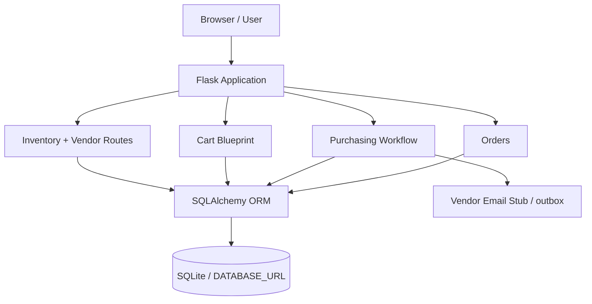
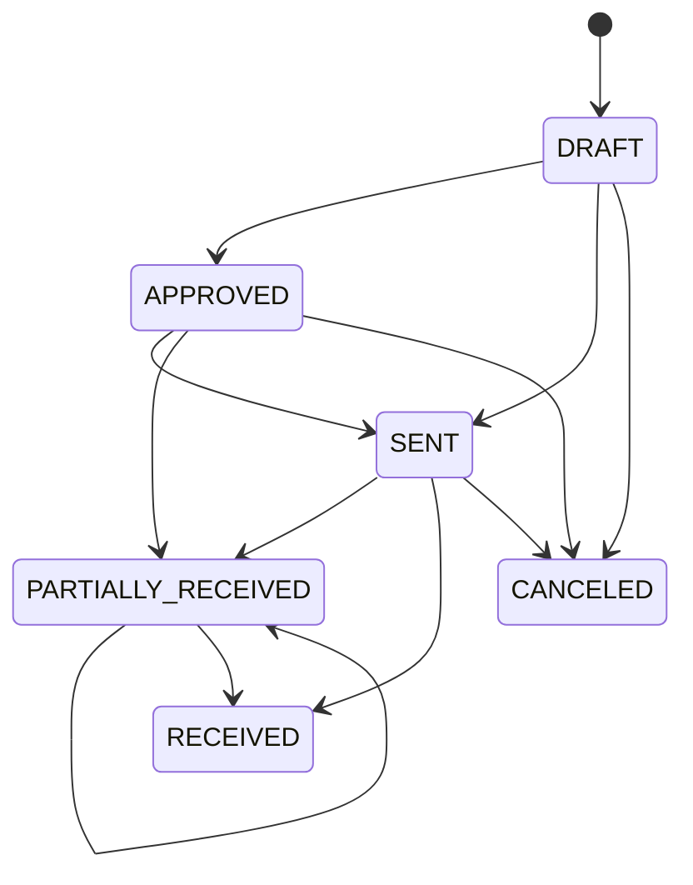

# GearShift Systems Architecture

## Purpose

GearShift Systems is a compact business application that models catalog, inventory, ordering, purchasing, and stock-receipt workflows for an automotive parts operation.

## High-level design

## Application layer

`app.py` uses an application-factory pattern. It owns application configuration, blueprint registration, inventory/vendor routes, order views, purchase-order lifecycle actions, CSV exports, and the deployment health endpoint.

`cart.py` isolates session-cart behavior and checkout persistence behind a Flask blueprint.

`paypal_mini.py` contains the small PayPal-oriented checkout helper.

## Data layer

`models.py` defines the relational domain:

- **Vendor** → supplier identity and contact information.
- **Part** → SKU, pricing, stock, shelf location, and reorder threshold.
- **Order / OrderItem** → customer order history with line-item snapshots.
- **PurchaseOrder / PurchaseOrderItem** → replenishment lifecycle.
- **StockMovement** → inventory receipt/audit history.

Order items intentionally keep snapshots of mutable catalog fields so historical order records remain meaningful if a part is renamed or repriced later.

## Purchasing state flow

## Portability

Runtime configuration is environment-driven:

- `DATABASE_URL` allows the persistence layer to move away from the default local SQLite database.
- `SECRET_KEY` keeps session signing out of source code.
- `PAYPAL_CLIENT_ID` / `PAYPAL_ENV` support sandbox/client configuration.

## Verification

GitHub Actions installs the project on Linux with Python 3.11 and 3.12, compiles the Python modules, and runs smoke/model tests. This catches import problems and filesystem assumptions that may not appear during Windows-only development.

## Deployment

`wsgi.py` exposes a Gunicorn-compatible application and initializes the schema for this portfolio deployment model. `Dockerfile` packages that runtime on Python 3.12 slim.

For a larger production system, database initialization should move to a formal migration tool such as Alembic/Flask-Migrate rather than happening at process startup.
